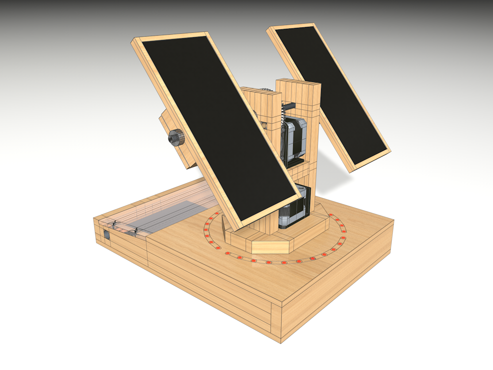
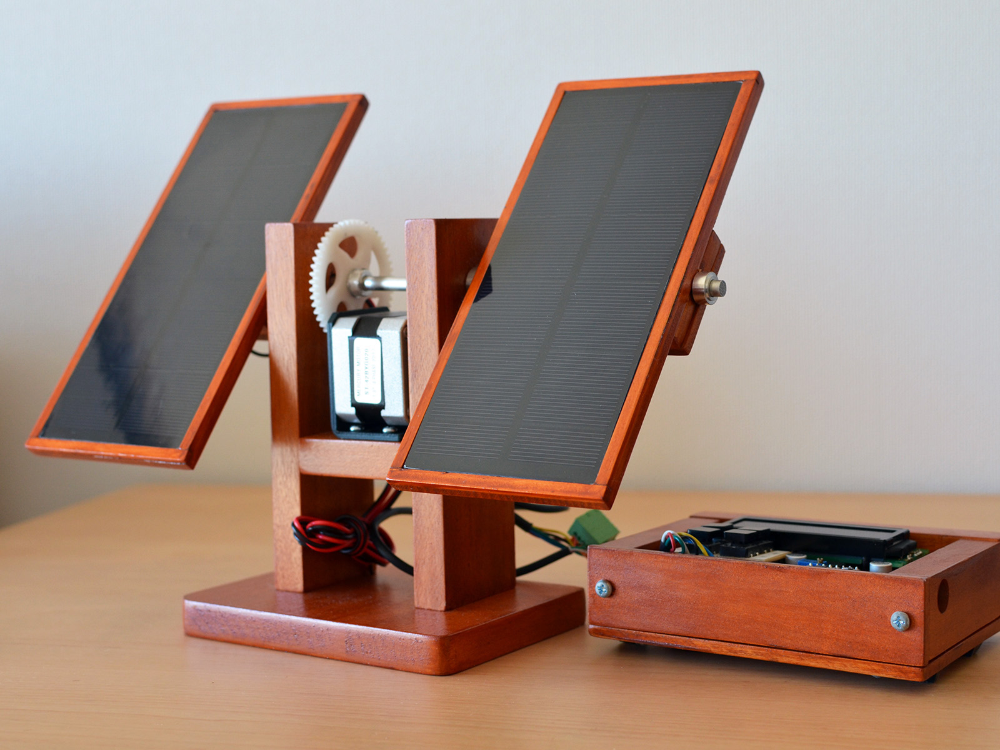

# SunTracker2 Revision 3

This project develops a photovoltaic (PV) solar tracking controller.
Pictured above is the current prototype. PV solar trackers control the PV
panel direction to keep the panel perpendicular to the Sun, maximizing the
power output. The power output difference for a fully aligned panel is
reported to be in a range of 15\~40%, which would be substantial.

## Design

The goal is a self-orienting dual-axis, scheduled, Arduino-based solar
tracker. I want to control PV panel orientation for both Elevation and
Azimuth angles (dual-axis), based on the calculated solar position of a PV
systems specific geographic location and time (scheduled).

Working under space, cost and time constraints, the prototype development is
done on a small scale model. Eventually, I want to control and optimize the
orientation of Mini-PV systems.

## Functional Design

In order to clearly understand and validate the sun tracking function, a 32
dual-color LED ring represents the horizon with north, sunrise and sunset
indicators. A green indicator displays the suns daily movement over time.
The optional NEMA stepper motor is used to develop the motor control code
for the solar panel horizontal alignment.

### Board Components

### Board Layout

The solar position data gets calculated off-system in advance, and saved into a
micro SD card. The pre-generated daily sun position files are then read by the
Arduino MKR Zero microcontroller through the onboard card reader. The
astronomical calculations of the suns position require sufficient CPU power, and
are taxing on Microcontrollers.

At the moment I am using a sun position dataset that covers two years of
operation, and uses approx. 20MB in size (46 MB with additional debug data). I
wrote the “suncalc” tool to pre-calculate the data set files for a specific
location, on a Linux PC.

### PCB

### Demo

<iframe width="560" height="315" src="https://www.youtube.com/embed/e8dpviy-tlI" frameborder="0" allow="accelerometer; autoplay; encrypted-media; gyroscope; picture-in-picture" allowfullscreen></iframe>
